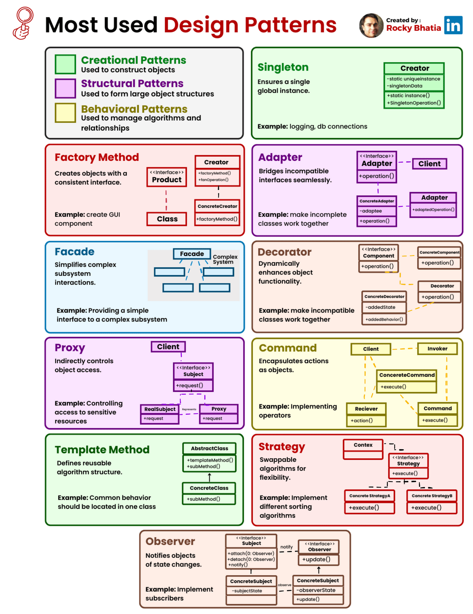

# Automation Framework

## Topics

### Selenium vs Cypress

### Selenium

#### Examples

Tree Folder Structure for Page Object Model (POM)

```text
SeleniumProject/
├── driver/
│   ├── chromedriver
│   └── geckodriver
├── resources/
│   └── config.json
├── tests/
│   ├── test_login.py
│   └── test_checkout.py
├── pages/
│   ├── login_page.py
│   ├── dashboard_page.py
│   └── checkout_page.py
├── utils/
│   ├── constants.py
│   ├── logger.py
│   └── assertions.py
└── reports/
    └── test_reports
```

Tree Folder Structure for Page Object Model with Components (POMC)

```text
SeleniumProject/
├── driver/
│   ├── chromedriver
│   └── geckodriver
├── resources/
│   └── config.json
├── tests/
│   ├── test_login.py
│   └── test_checkout.py
├── pages/
│   ├── login_page.py
│   ├── dashboard_page.py
│   └── checkout_page.py
├── components/
│   ├── header.py
│   ├── footer.py
│   ├── navigation_bar.py
│   └── search_box.py
├── utils/
│   ├── constants.py
│   ├── logger.py
│   └── assertions.py
└── reports/
    └── test_reports
```

### Design Pattern



## Reference

* [Test Practices](https://www.selenium.dev/documentation/test_practices/)
* [Page Object Model (POM) & Page Factory in Selenium](https://www.guru99.com/page-object-model-pom-page-factory-in-selenium-ultimate-guide.html)
* [SOLID Definition – the SOLID Principles of Object-Oriented Design Explained](https://www.freecodecamp.org/news/solid-principles-single-responsibility-principle-explained)
* [Object-Oriented Programming in Python](https://www.freecodecamp.org/news/object-oriented-programming-python/)
