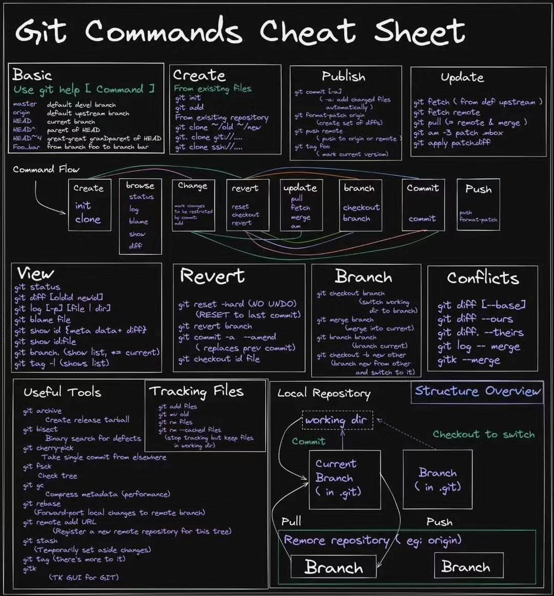
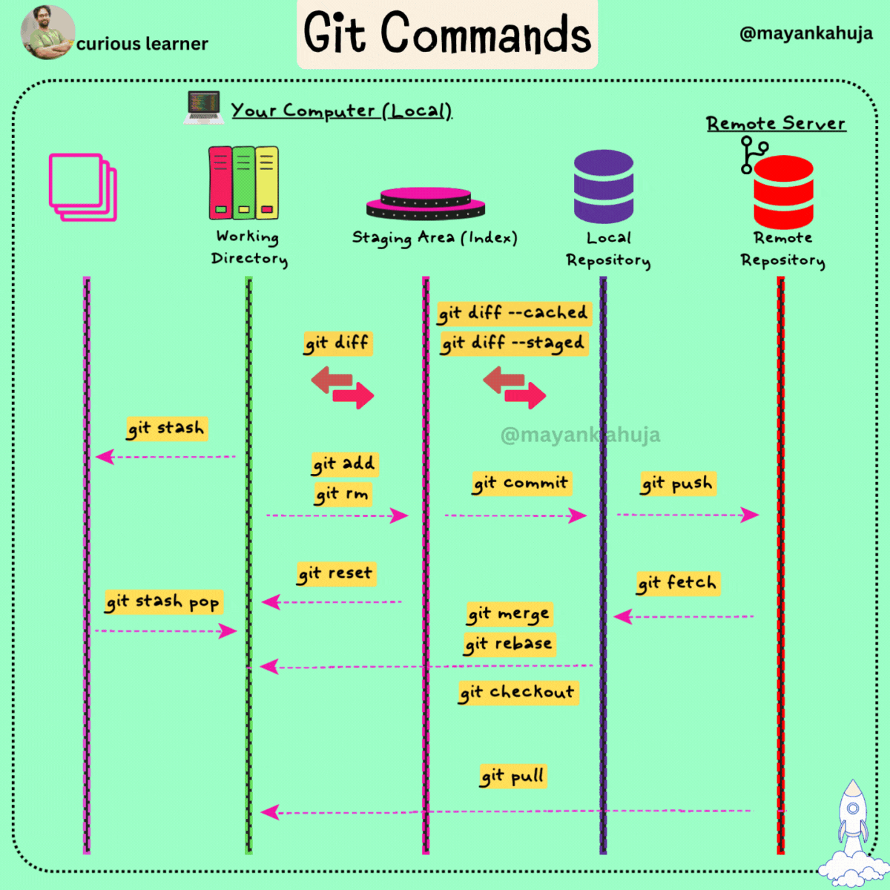

# GIT SHORT HAND

## Common Flows

```sh
"""
Create branch from server branch
"""

 git fetch $REMOTE_NAME
 git checkout -b $LOCAL_BRANCH_NAME $REMOTE_NAME/$SERVER_BRANCH_NAME
```

```sh
"""
Merged code local into the server
"""

 git fetch $REMOTE_NAME               # - Get the latest changes from $BRANCH in repo
 git rebase $REMOTE_NAME/$BRANCH_NAME # - Update your local against that of the main repo
 git push $REMOTE_NAME $BRANCH_NAME   # - Push your local change to server
```

```sh
"""
Fork and remote to server
"""
 
 git clone $REMOTE_FORK_URL
 git remote -v
 git remote add upstream ${REMOTE_URL}
```

```sh
"""
If you’re following a forking model is like this (let’s say the main repo is remote “main”, and you are updating your master against main’s)
"""

 git fetch $REMOTE_NAME             # - Get the latest changes from $BRANCH in repo
 git stash                          # - Put away your local change
 git merge $REMOTES($MAIN/$MASTER)  # - Update your local against that of the main repo
 git stash apply                    # - Put your local changes on top of your uopdated
```

```sh
"""
(Becarefully) Delete all commit history
"""

 git checkout --orphan latest_branch
 git add .
 git commit -m "commit message"
 git branch -D main
 git branch -m main
 git push -f origin main
```

```sh
"""
Squash commit
"""

 git log --oneline
 git rebase -i HEAD~n  # n commits then you can see only n-1 commits using HEAD~. To see all the commits you can specify --root instead of HEAD~

```

## Notice command

```sh
"""
git status

Git is constantly tracking what’s going on as you make changes locally 
Git status is going to return the files in your local repository in 2 categories, untracked and tracked.

This command is very important, because 
- What it says will affect what you do next commands (add & commit)
- This status represents the changed files Git detects across your project.
"""

 git status 
```

```sh
"""
git add

Notice
------
What git add . does is that it adds literally every file Git has detected a change with to be set up for a commit
. This is dangerous if a lot of the code you’ve created is actually generated, and your .gitignore doesn’t sufficiently cover them.
. This will lead to a lot of junk getting pushed to your remote, which will constantly generate noise on pull requests

=> Only run `git add .` if everything underneath the untracked files section is stuff that you want on remote.  
"""

 git add .          # <-- Try not to do this ! (Notice)
 git add $FILE_PATH
 git add -u         # Updated tracked files
```

```sh
"""
git commit

-a (add): What this does is that it grabs all of the changes you've made to existing files and packages them into your commit
-m (mesage): This allows you to attach the message associated with the commit from the command line
"""

 git commit -m $YOUR_COMMIT_MESSAGE
 git commit -am $YOUR_COMMIT_MESSAGE 
 git commit --author="John Doe <john@doe.org>" # Changing the Author Information Just for the Next Commit
```

```sh
"""
git push

By default, Git will push to whatever remote lies at origin
It will also push all local branches that don’t match their counterparts on the remote side, counterparts being determined by a simple name match.
Keep these notes in mind for when you’re pushing to non-origin remotes and the much rarer case of your local branch not having the same name as the remote one you’re updating.
"""

 git push $REMOTE_NAME $BRANCH_NAME

 # If you want to be specific and push a specific branch to a certain remote
 git push $REMOTE_NAME $MY_LOCAL_BRANCH_NAME:$REMOTE_BRANCH_NAME 
```

```sh
"""
git fetch

By default, a fetch will fetch from whatever the origin remote is in your git repository
What fetch does is it grabs all of the new code on remote so you can play around with it locally (rebase, cherry-pick, check out a new branch, etc)
Unlike git pull, it doesn’t do anything with your local code; you are fully in control.
 => This is why git pull is risky. In short, git pull does a fetch and then a merge, which gives you less control over how you want the new code to be integrated with yours.
"""

 git fetch origin
```

```sh
"""
git diff

This tells you exactly what code changes Git is currently aware of and what the commit will look like after you add/commit whatever
This will give you the lines added/deleted for that one file.
If the diff doesn’t match your expectations, you’re going to want to hit save in whatever IDE/text editor you’re using. You can also just do a git diff, but that gives you everything you have changed so far which is kind of a mess.
"""

 git diff $FILE_PATH
```

```sh
"""
git cherry-pick

Let’s say that there’s a single commit’s worth of code that you want to test/work with. 
However, there isn’t a branch you can merge/rebase against in order to only get that commit. This is when you do a cherry pick.
"""

 git cherry-pick $COMMIT_ID
```

```sh
"""
git stash

Stash is mainly relevant when you’re merging in code
Stash does is that it hides away your work in progress code in a safe place and you can bring it back whenever
"""

 git stash       # This “hides away” your code
 git stash apply # This brings back your most recently “hidden away” code
 git stash list  # Shows you the list of stashes you have locally (yup, you can have multiple stashes, Git is great)
```

```sh
"""
git branch

Figure out which branch you’re on along with all local branches
If you’re missing a branch, you either need to convert a remote branch into a local one and/or do a fetch.
"""

 git branch -av  # Figure out what branches exist (both local and remote)
 git branch -D   # Delete local branch
```

```sh
"""
git checkout
"""

 git checkout -- $FILE_PATH   # Remove File or Directory
 git checkout $BRANCH_NAME    # Start working on another branch
 git checkout -b $BRANCH_NAME # Create a new branch
```

```sh
"""
git remote
"""

 git remote -v  # Checking Your Current Remotes
 git remote add $NAME_REMOTE $REMOTE_URL
```

```sh
"""
git config
"""

 # Changing Your Committer Name & Email Globally
 git config --global user.name "John Doe"
 git config --global user.email "john@doe.org"

 # Changing Your Committer Name & Email per Repository
 git config user.name "John Doe"
 git config user.email "john@doe.org"
```

## Topics

### Reference by topics

#### GIT (Rebase >< Merge) What's the difference?

-----

* [What's the Difference?](https://phoenixnap.com/kb/git-rebase-vs-merge#:~:text=The%20main%20difference%20between%20git,the%20changes%20from%20both%20branches.&text=Allows%20users%20to%20merge%20branches%20in%20Git)
* [Why you should avoid using Git merge to update your branches?](https://blog.piotrnalepa.pl/2022/09/19/git-merge-vs-git-rebase-why-you-should-avoid-using-git-merge-to-update-your-branches/)
* [Merging vs. Rebasing](https://viblo.asia/p/git-merging-vs-rebasing-3P0lPvoGKox)

#### Squash

##### What is squashing?

Squashing is a process in which we squeeze multiple commits into one pretending it is only a single commit.

Basically squashing commits means we are rewriting the history of commits to make them look like single commit.

##### Why squashing commits is necessary?

Whenever sending pull requests we need to send it as a single commit.

* If pull request is sent with squashed commits it makes easier for maintainer to check what changes will be brought by the pull-request.
* Another benefit of single commit is if after merging new code, things don't go as planned then instead of going through a lot of commits and finding where things went wrong we can just revert a single commit and our code will start working as it was working earlier.

##### How to squash commits?

> NOTE: if you are a new git user and not much familiar with "vim editor" I would recommend you to look here ["Vim Guide"](https://scotch.io/tutorials/getting-started-with-vim-an-interactive-guide) or if you are using git on Linux you can switch to "nano" which is easy to use.
>
>To switch to nano run following command on your terminal(Linux only).
>
>```$ git config --global core.editor "nano"```
>
> to save any file in nano `Ctr + o`
>
> to exit nano `Ctr + x`

Now first, to squash we need to run following command which will allow us to edit the history.

```sh
git rebase -i HEAD~3
```

Here `-i` allows us to interact with history and not only seeing it.

After `HEAD~` you can specify any number and it will display those many last commits. If there are `n` commits then you can see only `n-1` commits using `HEAD~`. To see all the commits you can specify `--root` instead of `HEAD~`.

The output of the above command will be like this

```t
pick eead26c commit 1
pick 5099af5 commit 2
pick ac6f1b9 commit 3

# Rebase 6166ab6..ac6f1b9 onto 6166ab6 (3 commands)
#
# Commands:
# p, pick = use commit
# r, reword = use commit, but edit the commit message
# e, edit = use commit, but stop for amending
# s, squash = use commit, but meld into previous commit
# f, fixup = like "squash", but discard this commit's log message
# x, exec = run command (the rest of the line) using shell
# d, drop = remove commit
#
# These lines can be re-ordered; they are executed from top to bottom.
#
# If you remove a line here THAT COMMIT WILL BE LOST.
#
# However, if you remove everything, the rebase will be aborted.
#
# Note that empty commits are commented out
```

Here `commit 3` is the newest commit and `commit 1` is the oldest commit.
We can always only squash newer commits into older commits.

here we will squash commit 2 and 3 into commit 1. To do so we need to change `pick` into `s` in the line of commit 2 and 3. Save this file After doing following changes this file will look like following.

```t
pick eead26c commit 1
s 5099af5 commit 2
s ac6f1b9 commit 3

# Rebase 6166ab6..ac6f1b9 onto 6166ab6 (3 commands)
#
# Commands:
# p, pick = use commit
# r, reword = use commit, but edit the commit message
# e, edit = use commit, but stop for amending
# s, squash = use commit, but meld into previous commit
# f, fixup = like "squash", but discard this commit's log message
# x, exec = run command (the rest of the line) using shell
# d, drop = remove commit
#
# These lines can be re-ordered; they are executed from top to bottom.
#
# If you remove a line here THAT COMMIT WILL BE LOST.
#
# However, if you remove everything, the rebase will be aborted.
#
# Note that empty commits are commented out
```

Now to anytime after squashing if we want to push this changes into our origin/remote repository we need to push forcefully as we have rewritten the history. To forcefully push use the following command:

```sh
git push -f
```

>NOTE: Any time if you wish to see the list of commits you can you use:
>
>`$ git log`
>
> This will list all the commits

## Visualize





## Ref

* [Github CLI](https://cli.github.com/)
* [Hướng dẫn về git cho người mới bắt đầu](https://backlog.com/git-tutorial/vn/)
* [Getting Started With Git and GitHub in Your Python Projects](https://blog.martinfitzpatrick.com/git-github-python/)
* [Git Commands Every Software Engineer Should Know](https://www.jointaro.com/blog/git-commands-every-engineer-should-know-stop-using-version-control-incorrectly/)
